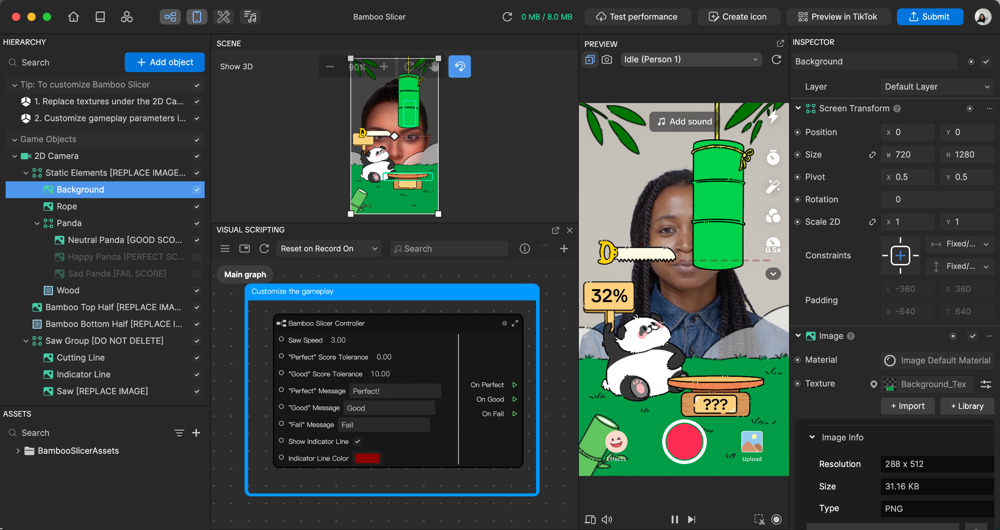
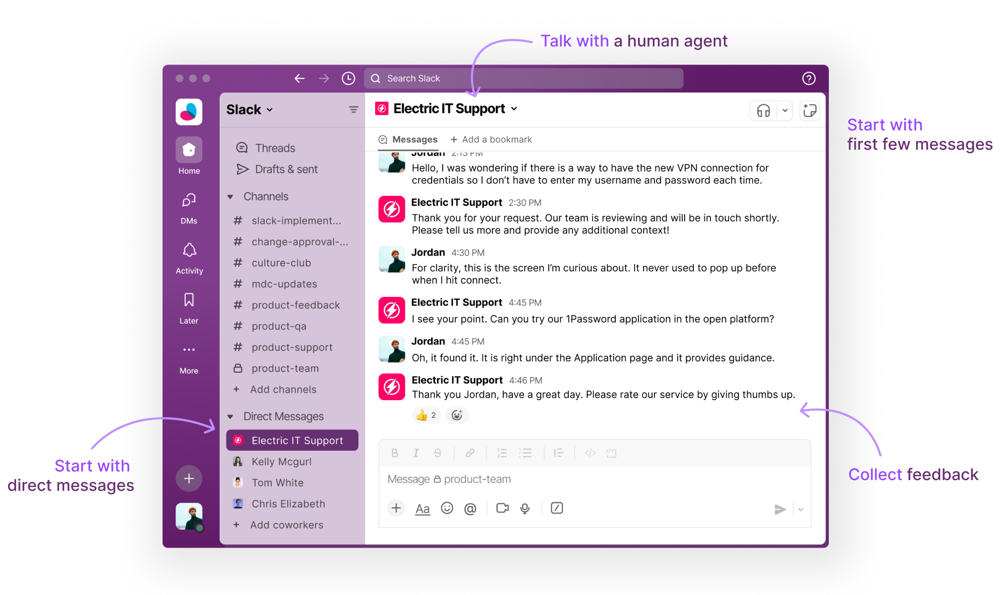
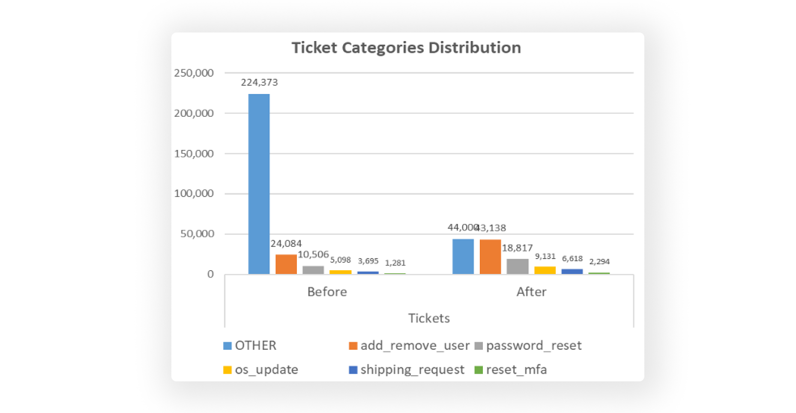
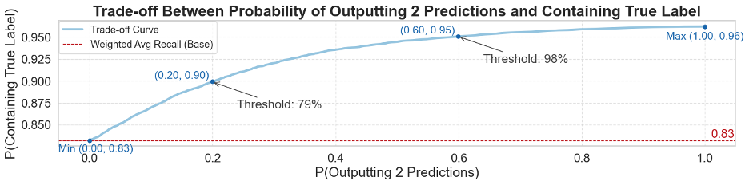
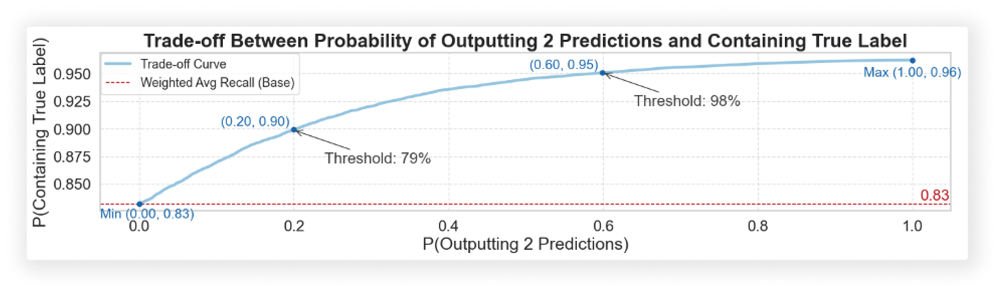
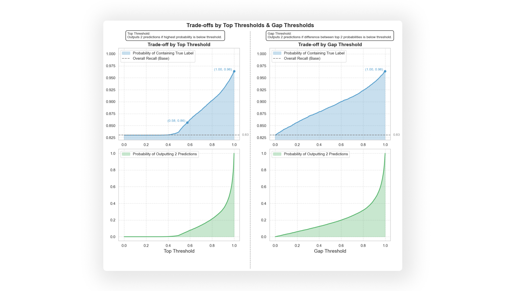
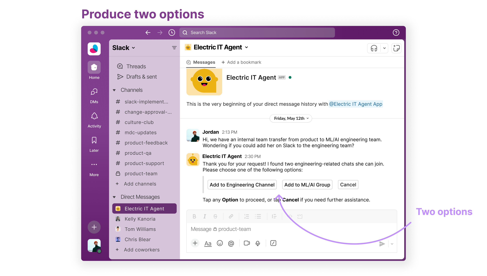

<head>
 <link rel="shortcut icon" type="image/png" href="assets/img/favicon.png">
</head>
 
# Technical Product Manager
> Technical Skills: Java, Python, SQL, AWS, Snowflake, and Figma

I am an MBA student at Columbia Business School and expect to graduate in Spring 2025. I am taking a series of Computer Science classes at Columbia Engineering. Before my MBA, I was a product manager at TikTok, building a 3D effect engine and working with the machine learning algorithm to allocate traffic on TikTok. I also worked in a series C1 B2B product-led growth designer collaboration platform and led the AI functions roadmap. My chill moment is enjoying avocado toast with a cup of orange juice on a bright Sunday morning.

### Project 1: 3D Effect Engine at TikTok
> Role: TikTok Product Manager @ Effects and Creation Team

I led product planning and design for the 3D effect engine at TikTok, in alignment with company-level revenue and profit goals. I have spearheaded the 3D effect engine’s usage growth and promotion effort, increasing the browsing rate by 62%. TikTok engine works both for Chinese TikTok and U.S. TikTok. The algorithm recommendation for effects only applies in Chinese TikTok. 

Image for the Product Design 👇🏻 

  

Gif for the Most Popular 3D Effects 👇🏻

  
  
  
  

### Project 2: Machine Learning Models at Columbia Business School
> Role: I conducted data cleaning, refined machine learning models, and designed product mockups

In 2024 Fall, I enrolled in the Analytics in Action class at Columbia Business School. I worked with a real company in this class to solve its problems in a team of five. Electric is a Series D startup founded in 2016. The company provides comprehensive IT support to over 1,000 clients and handles over 44,000 monthly IT tickets. It spends around 1.32 million per month on human agents to solve these tickets. Our project is to help Electric reduce this cost by designing a prediction model. The model will classify requests and determine whether they are automatable based on the first few messages. As a result, we designed a 2-option user interface mockup, reached an 80-90% accuracy range and saved $2 million annually.

#### Current Situation: A Chat-based System

  

Electric helps clients by solving their IT and security needs. Part of their help is about receiving tickets from email, website, and Slack. Most of the tickets are from Slack. User starts a direct message with a human agent. They solve the problem in the conversation. Electric handles 44,000 tickets monthly, costing them $1.3 million per month. While the existing human agents can handle tickets effectively, most of the tickets are repetitive and can be easily automated through classification models.

#### Key Data Challenges in Data Cleaning

The **first challenge** is message misalignment. The data contained entire conversations, many parts of which were irrelevant for initial category identification. We only need the first message for category prediction. We solved the problem by focusing solely on the initial user messages for immediate classification.

The **second challenge** is too many ticket categories and asterisks. With over 200 categories, predicting outcomes became complex. We solved the problem by consolidating these into 8 key, actionable categories. For asterisks, we prioritized data with minimal masking and filtered out over-masked messages.

The **third challenge** is data imbalance. Some categories had significantly more examples than others. We used upsampling and downsampling techniques such as SMOTE to balance the dataset. The left image is the data imbalance, while the right image is the results of SMOTE technique 👇🏻 

  

#### Build Category Prediction Models

The category prediction model used Snowflake embedding and logistic regression, tree-based, and neural network models.

- **Data Preparation**: Snowflake’s multilingual-e5-large embedding converted text into numerical vectors, capturing semantic and contextual information.  
- **Model Implementation**: We tested five models:
   - Logistic Regression
   - Random Forest
   - XGBoost
   - LightGBM
   - Multilayer Perceptron (MLP)
   Our focus was on precision — minimizing false positives in automation classification.  

In conclusion, LightGBM emerged as the top performer, achieving an 83% weighted average precision. Other models like XGBoost and Random Forest also delivered strong results, achieving approximately 82%. The image shows results across different models 👇🏻

  

### Refining Predictions: A Threshold-Based Approach

To further enhance accuracy, we implemented a threshold-based refinement for the LightGBM model. This involved selectively outputting one or two category predictions based on the model’s confidence level.

- **Top Threshold**: Outputting two predictions if the top-ranked prediction’s probability fell below a certain threshold.
  
- **Gap Threshold**: Outputting two predictions if the probability difference between the top two predictions was smaller than a threshold.

Recommendation: A threshold range of 79%-98% to ensure 90%-95% correct category inclusion while avoiding excessive two-prediction outputs.

  
  

#### Product Mockup from Threshold-based Approach
To demonstrate how the threshold-based model works in reality, we build several product mockups:

**Scenario 1**: when the prediction model is highly confident about one option, it produces only one result. 

  

 

**Scenario 2**: when the model is less confident about prediction results, it outputs two options.

  

   

#### Business Value and Final Thoughts
By automating 15.2% of Electric’s 44,000 monthly tickets (6,688 tickets), and assuming a $30 cost for manual handling and a 90% model precision, we project potential monthly savings of $180,576 and annual savings exceeding $2 million.

- **Monthly Savings**: 6,688 tickets x $30 per ticket x 90% precision = $180,576  
- **Yearly Savings**: $180,576 x 12 = $2,166,912  

In the future, we suggest removing the asterisks and cleaning the dataset for better performance. With the 90% accuracy of the current model, Electric could develop APIs for fully automated processes. This project demonstrated how machine learning techniques can transform IT support. By automating repetitive and routine IT requests, Electric can significantly improve efficiency, reduce costs, and empower the team to focus on more complex challenges.

#### References
- [Link to Electric.ai](https://www.electric.ai/)  
- [Link to TikTok Effect House](https://effecthouse.tiktok.com/)
